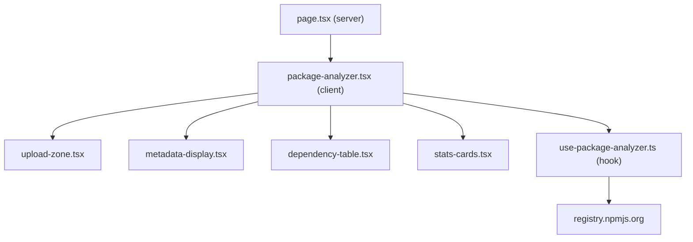

# Package.json Analyzer

## Architecture

Standalone route at `/analyzer`, outside the `(main)` route group (same pattern as `[apps/www/src/app/music/page.tsx](apps/www/src/app/music/page.tsx)`). Full-bleed dark layout, custom top nav with "Back" link, no shared Header/Footer.



## File structure

```
apps/www/src/app/analyzer/
  page.tsx                          # Server component with metadata
apps/www/src/components/analyzer/
  package-analyzer.tsx              # Main orchestrator (client)
  upload-zone.tsx                   # Drag-and-drop file upload with visual effects
  metadata-display.tsx              # Project name, version, license, author, repo
  dependency-table.tsx              # Sortable, filterable, expandable table
  stats-cards.tsx                   # Summary stats (total deps, outdated count, etc.)
apps/www/src/hooks/
  use-package-analyzer.ts           # All state, parsing, API fetching, sorting, filtering
apps/www/src/lib/
  npm-registry.ts                   # npm API helpers, URL cleaning, throttling
```

## Design direction

Maintain the existing aesthetic: **dark editorial** (`bg-neutral-950`), **Geist Mono** typography, **yellow-400 accent** for highlights and interactive elements, **OKLCH semantic tokens** for cards/borders/muted text. Leverage the `motion/react` library already in the project for entrance animations and state transitions.

### Upload zone

- Full-width drop zone with dashed border using `border-border`, pulsing on drag-over
- Centered `Package` icon from lucide with subtle floating animation
- On file drop: the zone contracts and slides up, revealing the analysis dashboard below
- Use `motion.div` with `layout` and `AnimatePresence` for the transition

### Stats cards

- Row of 4 metric cards after upload: **Total packages**, **Outdated**, **Up to date**, **Average age**
- Each card uses shadcn `Card` with the semantic color tokens
- Yellow accent badge on the "outdated" count, green accent on "up to date"
- Staggered entrance via `motion.div` with `transition.delay`

### Dependency table

- Built on shadcn `Table` + `Tabs` (dependencies vs devDependencies)
- `Badge` for package counts on each tab
- Sortable column headers with `ArrowUpDown` / `ArrowUp` / `ArrowDown` icons
- Expandable rows using `Collapsible` for per-package details (description, dates, links)
- "Expand All" / "Collapse All" buttons
- Search input using shadcn `Input` with `Search` icon
- Outdated indicator: yellow `Badge` with version diff; up-to-date gets a green `CheckCircle`
- External links (npm, GitHub) with `ExternalLink` icon, `target="_blank"`, `rel="noopener noreferrer"`
- Responsive column hiding per FR-13.2 specs

### Loading state

- `Skeleton` rows in the table while fetching
- `Progress` bar showing fetch completion percentage (X of N packages loaded)
- "Analyzing packages..." text with `Spinner`

### Error states

- Use shadcn `Alert` with `AlertTriangle` icon for parse/empty/API/rate-limit errors
- "Try Again" button re-triggers analysis from last uploaded file

### Metadata display

- Horizontal row of labeled values: Name, Version, License, Author, Repository
- Repository renders as a yellow-accented external link
- Author supports both string and `{name, email, url}` object formats

## Existing components to use

Already installed in `[apps/www/src/components/ui/](apps/www/src/components/ui/)`:

- `table.tsx`, `tabs.tsx`, `badge.tsx`, `card.tsx`, `input.tsx`, `button.tsx`
- `skeleton.tsx`, `progress.tsx`, `spinner.tsx`, `alert.tsx`, `collapsible.tsx`
- `separator.tsx`, `tooltip.tsx`, `scroll-area.tsx`

## Integration points

- Add `/analyzer` to `[apps/www/src/app/sitemap.ts](apps/www/src/app/sitemap.ts)` routes array
- Optionally add to `AppsBlock` links in `[apps/www/src/components/apps-block.tsx](apps/www/src/components/apps-block.tsx)`
- No server-side API routes needed; all npm registry calls happen client-side via `fetch` to `https://registry.npmjs.org/{pkg}`

## Key implementation details

- **Throttling**: 100ms delay between sequential npm registry requests (FR-5.2)
- **Timeout**: 10s `AbortController` per request (FR-5.4)
- **Progressive loading**: fetch packages one-by-one, updating the table as each resolves (FR-5.3)
- **Sorting**: client-side, cycles through asc/desc/none (FR-7.2)
- **Search**: case-insensitive filter on name + description (FR-8.2-8.3)
- **GitHub URL cleaning**: strip `git+`, `git://`, `.git`, `ssh://git@` prefixes (FR-14.3)
- **Scrollbar stability**: `scrollbar-gutter: stable` on the main container (FR-13.4)
- **No partial data on error**: clear everything and show error (FR-9.2-9.3)
